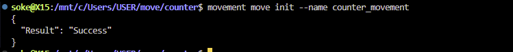
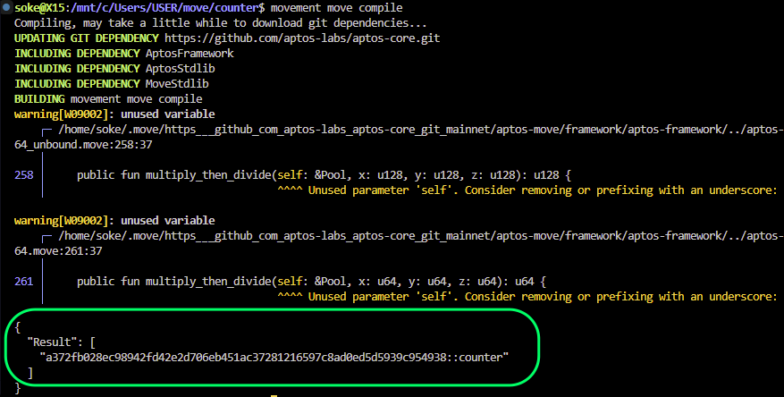
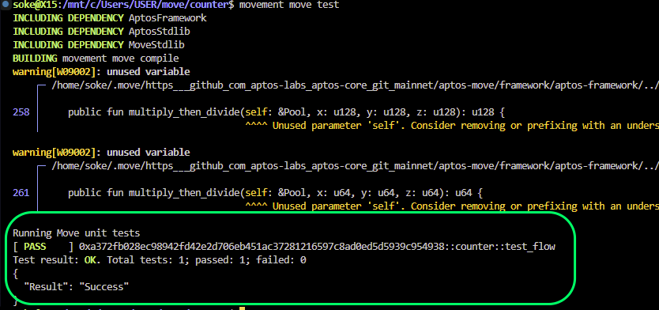
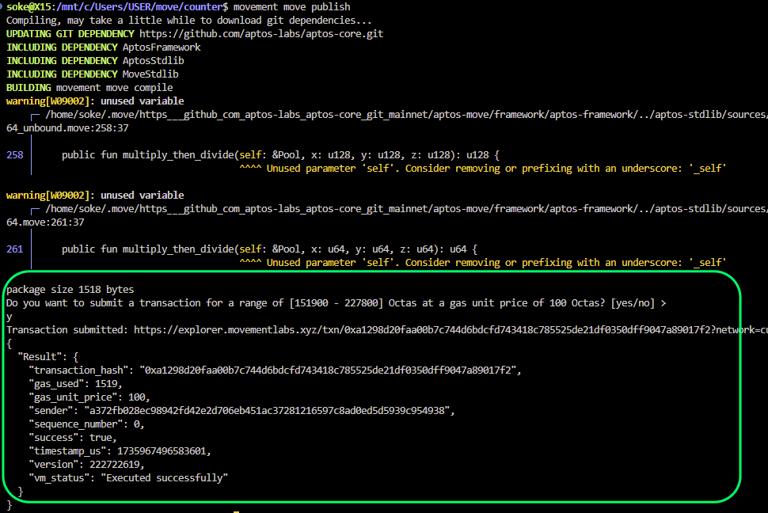

# Counter Movement
## Overview
This guide provides a comprehensive overview of implementing a basic counter in Move, covering definition, initialization, and functions for incrementing and decrementing the counter. .

## Prerequisites
Ensure you have either the Movement CLI installed. If not, you can install  the Movement CLI from the [Movement CLI Installation Guide](https://movement.dev/docs/movement-cli).


### Required Imports
```move
use std::signer;
#[test_only]
use aptos_framework::account;
```

### Count Struct Definition
```move
struct Count has key {
    count: u64
}
```
The `Count` struct has one essential attribute:

- `count`: Holds the current value of the counter.

### Constructor Function
```move
public entry fun createcounter(account: &signer) {
    let addr = signer::address_of(account);
    
    if (!exists<Count>(addr)) {
        move_to(account, Count { count: 0 });
    }
}
```
This function initializes the counter to `0` for the specified account if it hasn't been initialized already.

### Function for Raising the Counter Value
```move
public entry fun raise_c(account: &signer) acquires Count {
    let signer_add = signer::address_of(account);
    assert!(exists<Count>(signer_add), E_NOT_INITIALIZED);
    let number_p = borrow_global_mut<Count>(signer_add);
    let counter = number_p.count + 1;
    number_p.count = counter;
}
```
This function increments the counter value by 1.

### Function for Decrementing the Counter Value
```move
public entry fun decrement_c(account: &signer) acquires Count {
    let signer_add = signer::address_of(account);
    assert!(exists<Count>(signer_add), E_NOT_INITIALIZED);
    let number_p = borrow_global_mut<Count>(signer_add);
    let counter = number_p.count - 1;
    number_p.count = counter;
}
```
This function decrements the counter value by 1.

### Testing the Implementation
```move
#[test(admin = @0x123)]
public entry fun test_flow(admin: signer) acquires Count {
    account::create_account_for_test(signer::address_of(&admin));
    createcounter(&admin);
    raise_c(&admin);
    decrement_c(&admin);
}
```
This test function runs the entire flow for creating a counter, raising it, and then decrementing it for a given admin account.


## Initialization
Initialize your project by running the following command and choosing the testnet network:
```bash
movement move init
```


## Compilation
Compile the Move module using the following command:
```bash
movement move compile
```


## Testing
Test the Move module with the following command:
```bash
movement move test
```


## Deployment
Publish the Move module to the blockchain using the following command:
```bash
movement move publish
```


This will execute all test functions in the module and display the debug output.