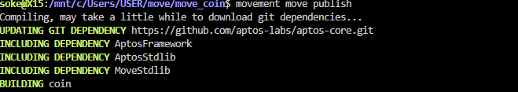

# Create a Coin on Movement Using Move

## Overview
This guide walks through creating a custom coin on Movement network using the Move programming language. Below, you'll find an explanation of each part of the module, key commands for initialization and minting, and screenshots placeholders for visualization.

---

## Prerequisites

### Installation
## Prerequisites
- **Movement CLI** Ensure you have Movement CLI installed. If not, you can install the Movement CLI from the [Developer portal guide](https://developer.movementnetwork.xyz/learning-paths/basic-concepts/01-install-movement-cli), or follow my instructions to [install on Windows](https://github.com/soke-dev/100-days-of-move/blob/main/docs/MoveCLIonWSL.md)

---

## Project Setup

Before writing the module, you need to set up a folder and initialize it for Move development using the Movement CLI. Follow these steps:

### 1. Create a Project Folder
Create a new folder for your project and navigate into it:
```bash
mkdir goodcoin_project
cd goodcoin_project
```

### 2. Initialize the Move Project
Initialize the project with the Movement CLI to set up necessary configurations:
```bash
movement move init --name goodcoin
```

### 3. Configure Network
Set up the project to connect to the Movement testnet:
```bash
movement init --network custom --rest-url https://aptos.testnet.porto.movementlabs.xyz/v1 --faucet-url https://fund.testnet.porto.movementlabs.xyz
```


---
## GoodCoin Module

### Module Breakdown

#### 1. Importing Dependencies
The module starts by importing necessary modules for account management, strings, and the coin framework.
```move
use std::signer;
use std::string;
use aptos_framework::coin;
```

#### 2. Error Codes
Custom error codes are defined for better error handling during operations like admin validation or capability checks.
```move
const ENOT_ADMIN: u64 = 0;
const E_ALREADY_HAS_CAPABILITY: u64 = 1;
const E_DONT_HAVE_CAPABILITY: u64 = 2;
```

#### 3. Defining Resources
- **`GoodCoin`**: Represents the custom coin.
- **`CoinCapabilities`**: Stores mint, burn, and freeze capabilities for the admin account.
```move
struct GoodCoin has key {}

struct CoinCapabilities has key {
    mint_cap: coin::MintCapability<GoodCoin>,
    burn_cap: coin::BurnCapability<GoodCoin>,
    freeze_cap: coin::FreezeCapability<GoodCoin>
}
```

#### 4. Helper Functions
- **`is_admin`**: Ensures the caller is the admin.
- **`have_coin_capabilities`**: Checks if the account has coin capabilities.
- **`not_have_coin_capabilities`**: Ensures the account does not already have coin capabilities.
```move
public fun is_admin(addr: address) {
    assert!(addr == @admin, ENOT_ADMIN);
}

public fun have_coin_capabilities(addr: address) {
    assert!(exists<CoinCapabilities>(addr), E_DONT_HAVE_CAPABILITY);
}

public fun not_have_coin_capabilities(addr: address) {
    assert!(!exists<CoinCapabilities>(addr), E_ALREADY_HAS_CAPABILITY);
}
```

#### 5. Initializing the Module
The `init_module_internal` function ensures only the admin can initialize the coin and assigns mint, burn, and freeze capabilities to the admin account.
```move
fun init_module_internal(account: &signer) {
    let account_addr = signer::address_of(account);
    is_admin(account_addr);
    not_have_coin_capabilities(account_addr);

    let (burn_cap, freeze_cap, mint_cap) = coin::initialize<GoodCoin>(
        account,
        string::utf8(b"Good Coin"),
        string::utf8(b"GOOD"),
        8,
        true
    );
    move_to(account, CoinCapabilities {mint_cap, burn_cap, freeze_cap});
}
```

#### 6. Entry Functions

- **`initialize`**: Deploys and initializes the GoodCoin module.
```move
public entry fun initialize(account: &signer) {
    init_module_internal(account);
}
```

- **`register`**: Allows users to register their wallet to hold GoodCoin.
```move
public entry fun register(account: &signer) {
    coin::register<GoodCoin>(account);
}
```

- **`mint`**: Enables the admin to mint tokens to a user’s address.If you want to have a fixed supply, remove mint_cap from the resource. Then destroy mint cap after minting the supply.
```move
public entry fun mint(account: &signer, user: address, amount: u64) acquires CoinCapabilities {
    let account_addr = signer::address_of(account);

    is_admin(account_addr);
    have_coin_capabilities(account_addr);

    let mint_cap = &borrow_global<CoinCapabilities>(account_addr).mint_cap;
    let coins = coin::mint<GoodCoin>(amount, mint_cap);
    coin::deposit<GoodCoin>(user, coins);
}
```

- **`burn`**: Allows the admin to burn tokens from circulation.
```move
public entry fun burn(account: &signer, amount: u64) acquires CoinCapabilities {
    let coins = coin::withdraw<GoodCoin>(account, amount);
    let burn_cap = &borrow_global<CoinCapabilities>(@admin).burn_cap;
    coin::burn<GoodCoin>(coins, burn_cap);
}
```

---

## Completed Code

Below is the complete Move module code for GoodCoin:

```move
module coin::goodcoin {
    use std::signer;
    use std::string;
    use aptos_framework::coin;

    const ENOT_ADMIN: u64 = 0;
    const E_ALREADY_HAS_CAPABILITY: u64 = 1;
    const E_DONT_HAVE_CAPABILITY: u64 = 2;

    struct GoodCoin has key {}

    struct CoinCapabilities has key {
        mint_cap: coin::MintCapability<GoodCoin>,
        burn_cap: coin::BurnCapability<GoodCoin>,
        freeze_cap: coin::FreezeCapability<GoodCoin>
    }

    public fun is_admin(addr: address) {
        assert!(addr == @admin, ENOT_ADMIN);
    }

    public fun have_coin_capabilities(addr: address) {
        assert!(exists<CoinCapabilities>(addr), E_DONT_HAVE_CAPABILITY);
    }

    public fun not_have_coin_capabilities(addr: address) {
        assert!(!exists<CoinCapabilities>(addr), E_ALREADY_HAS_CAPABILITY);
    }

    fun init_module_internal(account: &signer) {
        let account_addr = signer::address_of(account);
        is_admin(account_addr);
        not_have_coin_capabilities(account_addr);

        let (burn_cap, freeze_cap, mint_cap) = coin::initialize<GoodCoin>(
            account,
            string::utf8(b"Good Coin"),
            string::utf8(b"GOOD"),
            8,
            true
        );
        move_to(account, CoinCapabilities {mint_cap, burn_cap, freeze_cap});
    }

    public entry fun initialize(account: &signer) {
        init_module_internal(account);
    }

    public entry fun mint(account: &signer, user: address, amount: u64) acquires CoinCapabilities {
        let account_addr = signer::address_of(account);

        is_admin(account_addr);
        have_coin_capabilities(account_addr);

        let mint_cap = &borrow_global<CoinCapabilities>(account_addr).mint_cap;
        let coins = coin::mint<GoodCoin>(amount, mint_cap);
        coin::deposit<GoodCoin>(user, coins);
    }

    public entry fun register(account: &signer) {
        coin::register<GoodCoin>(account);
    }

    public entry fun burn(account: &signer, amount: u64) acquires CoinCapabilities {
        let coins = coin::withdraw<GoodCoin>(account, amount);
        let burn_cap = &borrow_global<CoinCapabilities>(@admin).burn_cap;
        coin::burn<GoodCoin>(coins, burn_cap);
    }
}
```

---

### Compile the Module
To ensure your GoodCoin module is free of errors, compile it using the following command:
```bash
movement move compile
```


### Publish the Module
Once compiled successfully, publish the module to the blockchain:
```bash
movement move publish
```


## Commands to Interact with the Coin

### 1. Initialize the Coin
Run the following command to deploy and initialize the Coin (if using a different name replace goodcoin with your module name):
```bash
movement move run --function-id <your_address_here>::goodcoin::initialize --args
```

### 2. Register a Wallet
To allow a wallet to hold GoodCoin, register it using:
```bash
movement move run --function-id <your_address_here>::goodcoin::register --args
```


### 3. Mint Tokens
Mint GoodCoin to a specific wallet using this command:
```bash
movement move run --function-id <your_address_here>::goodcoin::mint --args address:<your_address_here> u64:<supply>
```


- **Supply Precision**: When defining a token supply, remember that GoodCoin supports up to 8 decimal places. If you want to mint 1,000,000 tokens, you need to add 8 trailing zeros to represent the supply correctly (e.g., 100000000000000 for 1,000,000 tokens). This ensures compatibility with the decimal standard.
---

## Wallet Balance
After minting, verify the balance of GoodCoin in the wallet:


### Address Format for Custom Coins
The custom address for interacting with the coin follows this structure:
```plaintext
0x{address}::{module}::{struct}
```
For **GoodCoin**, the address will look like this:
```plaintext
0x<your_address_here>::Goodcoin::GoodCoin
```
Replace `<your_address_here>` with the actual address where the module is deployed. For example, in this case:
```plaintext
0xa372fb028ec98942fd42e2d706eb451ac37281216597c8ad0ed5d5939c954938::Goodcoin::GoodCoin
```
