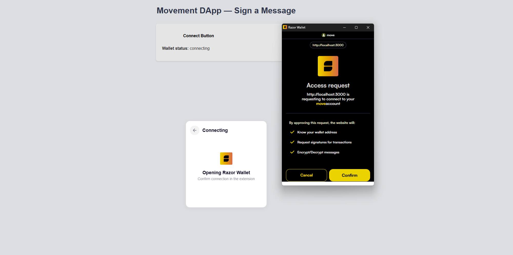
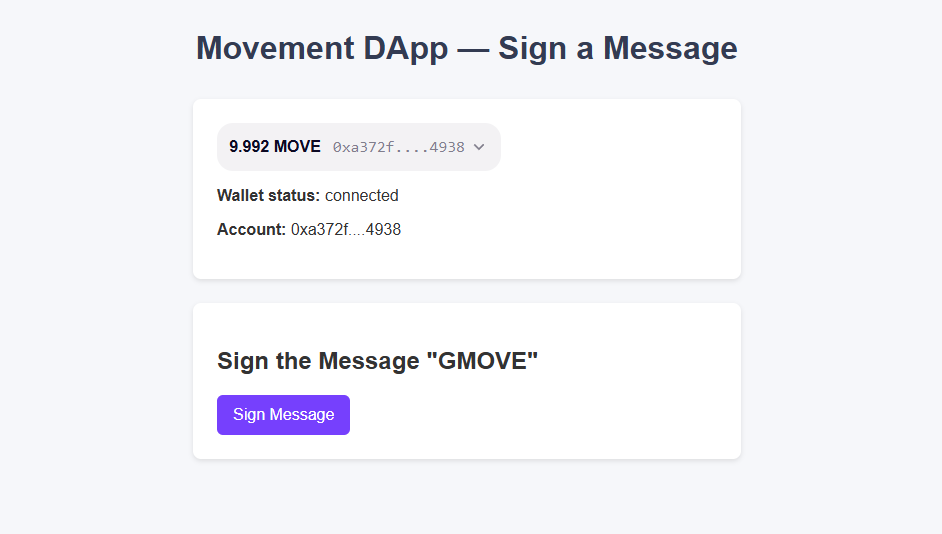
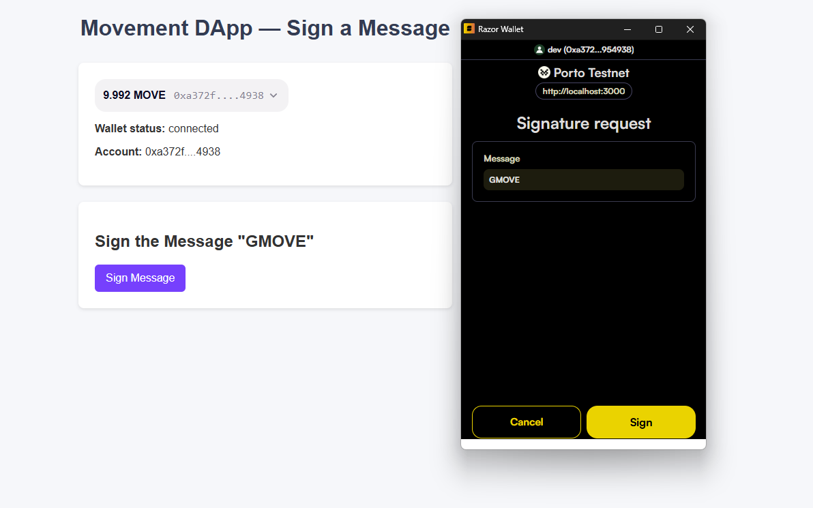

# GMOVE Message Signing on Movement network with Razor Wallet Kit

This **tutorial** guides you through building a simple React DApp that:

1. Uses **Razor Wallet Kit** to connect to an Movement wallet.  
2. Displays wallet status and account info.  
3. **Signs** a custom message (e.g., `"GMOVE"`)

---

## Table of Contents

1. [Prerequisites](#prerequisites)  
2. [Project Setup](#project-setup)  
   - [1. Create a New React App](#1-create-a-new-react-app)  
   - [2. Install Dependencies](#2-install-dependencies)  
3. [File Structure](#file-structure)  
4. [Create and Edit Files](#create-and-edit-files)  
   - [1. src/index.js](#1-srcindexjs)  
   - [2. src/App.js](#2-srcappjs)  
   - [3. src/index.css](#3-srcindexcss)  
5. [Run the App](#run-the-app)  
6. [Demo & Screenshots](#demo--screenshots)  
   - [Steps to Demo](#steps-to-demo)  
   - [Screenshots](#screenshots)  
7. [How It Works](#how-it-works)  
8. [Further Customizations](#further-customizations)
9. [Resources](#Resources)
---

## Prerequisites

- **Node.js** (v14+) and **npm** (or Yarn).  
- Basic knowledge of React and modern JavaScript.  
- An **Movement wallet** installed in your browser (e.g., Razor Wallet, Nightly, etc.).

---

## Project Setup

### 1. Create a New React App

1. **Create a new folder** for your project (e.g., `gmove-dapp`).  
2. **Open a terminal** in that folder and run:
   ```bash
   npx create-react-app .
   ```
   > The `.` indicates you want to initialize the React project in the **current folder**.

3. After it finishes, you’ll have the default React structure with `src`, `public`, and other files.

### 2. Install Dependencies

While inside your project folder, install the following:
- **Aptos** (Aptos SDK for JavaScript/TypeScript)
- **@razorlabs/wallet-kit** (Razor Wallet connectivity)

```bash
npm install aptos @razorlabs/wallet-kit
```

---

## File Structure

Your folder now looks like:

```
gmove-dapp/
  ├─ node_modules/
  ├─ public/
  ├─ src/
  │  ├─ App.js
  │  ├─ index.js
  │  ├─ index.css
  │  └─ ...
  ├─ package.json
  ├─ package-lock.json
  └─ README.md (this file)
```

---

## Create and Edit Files

Below are **minimal** versions of `index.js`, `App.js`, and `index.css` that integrate Razor Wallet Kit and sign a message.

### 1. `src/index.js`

Wrap your `<App />` with `AptosWalletProvider`. Configure the networks (e.g., testnet, mainnet).

```jsx
// src/index.js

import React from 'react';
import { createRoot } from 'react-dom/client';
import { AptosWalletProvider } from '@razorlabs/wallet-kit';
import App from './App';

// Define your Movement networks
const networks = [
 onst networks = [
  {
    name: 'Movement Porto Testnet',
    chainId: '177',
    rpcUrl: 'https://aptos.testnet.porto.movementlabs.xyz/v1',
  },
  {
    name: '',
    chainId: '',
    rpcUrl: '',
  },
];

const container = document.getElementById('root');
const root = createRoot(container);

root.render(
  <AptosWalletProvider networks={networks} defaultNetwork="testnet">
    <App />
  </AptosWalletProvider>
);
```

### 2. `src/App.js`

Below is an example **App.js** with two main parts:
1. **WalletConnectUI** sub-component: handles Connect button, wallet status, and address display.
2. **Message signing** section: user can sign the message `"GMOVE"` when connected.

```jsx
// src/App.js

import React, { useState } from 'react';
import {
  AptosConnectButton,
  useAptosWallet,
  addressEllipsis,
} from '@razorlabs/wallet-kit';
import '@razorlabs/wallet-kit/style.css'; 
import './index.css'; // Our custom CSS

/* 
  Sub-component: 
  - Connect button
  - Display wallet status & account address
*/
function WalletConnectUI() {
  const wallet = useAptosWallet();

  return (
    <div className="card">
      <AptosConnectButton className="custom-connect-button" />
      <p>
        <strong>Wallet status:</strong> {wallet.status}
      </p>
      {wallet.account && (
        <p>
          <strong>Account:</strong> {addressEllipsis(wallet.account.address)}
        </p>
      )}
    </div>
  );
}

/* 
  Main App component:
  - Renders WalletConnectUI
  - Provides a button to sign the "GMOVE" message
*/
function App() {
  const wallet = useAptosWallet();
  const [signature, setSignature] = useState(null);

  async function signMessage() {
    if (!wallet.connected) {
      alert('Please connect your wallet first!');
      return;
    }
    try {
      const res = await wallet.signMessage({
        message: 'GMOVE',
        nonce: '1234', // Example nonce
      });
      console.log('Signed message result:', res);
      setSignature(res.signature);
      alert('Message signed successfully!');
    } catch (error) {
      console.error('Signing message failed:', error);
      alert('Failed to sign message. Check console for details.');
    }
  }

  return (
    <div className="app-container">
      <h1 className="app-title">Movement DApp — Sign a Message</h1>
      <WalletConnectUI />
      {wallet.status === 'connected' && (
        <div className="card">
          <h2>Sign the Message "GMOVE"</h2>
          <button onClick={signMessage} className="primary-button">
            Sign Message
          </button>
          {signature && (
            <div style={{ marginTop: '1rem' }}>
              <strong>Signature:</strong>
              <p>{signature}</p>
            </div>
          )}
        </div>
      )}
    </div>
  );
}

export default App;
```

### 3. `src/index.css`

Use this CSS for a **clean** layout:

```css
/* src/index.css */

/* Global reset & base */
body {
  margin: 0;
  padding: 0;
  background: #f5f7fa;
  font-family: Arial, sans-serif;
  color: #333;
}

.app-container {
  display: flex;
  flex-direction: column;
  align-items: center;
  padding: 2rem;
  max-width: 700px;
  margin: 0 auto;
}

.app-title {
  margin: 0.5rem;
  font-size: 2rem;
  color: #2c3e50;
}

/* Card style */
.card {
  background: #fff;
  width: 100%;
  max-width: 500px;
  padding: 1.5rem;
  margin-top: 1.5rem;
  border-radius: 8px;
  box-shadow: 0 2px 5px rgba(0,0,0,0.1);
}

/* Main button style */
.primary-button {
  background-color: #6366f1;
  color: #fff;
  border: none;
  padding: 0.7rem 1rem;
  font-size: 1rem;
  border-radius: 6px;
  cursor: pointer;
}
.primary-button:hover {
  background-color: #4f46e5;
}

/* Example custom connect button override */
.custom-connect-button {
  background-color: #6366f1;
  color: #fff !important;
  border-radius: 6px;
  padding: 0.7rem 1rem;
  margin-bottom: 1rem;
  border: none;
  cursor: pointer;
  font-size: 1rem;
}
.custom-connect-button:hover {
  background-color: #4f46e5;
}
```

---

## Run the App

In your project’s root directory:

```bash
npm start
```

1. Open [http://localhost:3000](http://localhost:3000) in your browser.  
2. **Connect** your wallet (e.g., Razor Wallet).  
3. If connected, click **"Sign Message"** to sign the `"GMOVE"` message.  
4. The signature appears below the button.  

Check your **browser console** for the detailed result of the signature request.

---
## How It Works

1. **AptosWalletProvider**  
   - Provides context for Razor Wallet Kit to detect wallets, manage connection state, and sign requests.

2. **`useAptosWallet` Hook**  
   - **`wallet.status`**: `'disconnected'`, `'connected'`, etc.  
   - **`wallet.account`**: The connected account’s address, publicKey, etc.  
   - **`wallet.signMessage(...)`**: Prompts the wallet to sign a custom message.

3. **UI**  
   - **`WalletConnectUI`** sub-component: Displays the connect button and account details.  
   - **Sign Message** card: Visible only if `wallet.status === 'connected'`.

---

### Steps to Demo

1. **Open** your DApp in the browser (e.g., `http://localhost:3000`).  
2. **Click** the **Connect** button to open the Razor wallet connect flow.  
3. **Approve** the connection request in your Movement Wallet.
4. Once connected, notice the **wallet status** and **account address** fields update.  
5. **Click** **Sign Message** to sign `"GMOVE"`.  
6. **Confirm** in the wallet popup.  
7. After approval, a success alert is shown, and the signature is displayed in your DApp.

### Screenshots





---

## Further Customizations

- **Change the Signed Message**  
  - In `App.js`, replace `message: 'GMOVE'` with any string (like `"Hello, Movement!"`).

- **Use a Random Nonce**  
  - `nonce: Date.now().toString()` to ensure uniqueness each time.

- **Custom UI for Connect**  
  - Instead of `<AptosConnectButton>`, build your own connect button with `wallet.connect()` and `wallet.disconnect()` for total design control.

- **Network Switching**  
  - Define multiple networks in `index.js` and call `wallet.switchNetwork('mainnet')` or `'testnet'` to change networks on-the-fly.

That’s it! You now have a **React** DApp that connects to **Movement** with **Razor Wallet Kit** and signs a custom message (“GMOVE”). From here, you can extend it to handle **on-chain transactions**, **token interactions**, or **NFT minting**—the possibilities are endless. Happy building!


## Resources

- [Razor Wallet Kit Documentation](https://kit.razorwallet.xyz/docs/QuickStart/) – Official docs for integrating Razor’s wallet connection toolkit.  
- [Razor Wallet](https://razorwallet.xyz/) – Download and learn more about the Razor wallet.

