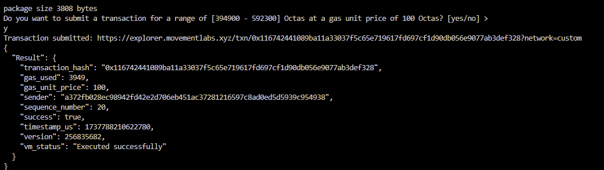

# This module is part of our NFT Move tutorial. In this module, we go over how to create a collection and token, and then mint a token to a receiver on Movement Testnet.

**Full Source Code**: Please see the `sources` folder in this repository for the complete Move module.

## Table of Contents

1. [Overview](#overview)  
2. [Module Explanation](#module-explanation)  
3. [Compile and Publish](#compile-and-publish)  
4. [Usage](#usage)  

---

## Overview

In this **NFT Move tutorial**, we demonstrate how to:

1. **Create a collection** with specified metadata (like name, description, URI).  
2. **Define a token** under that collection, potentially reusing the same base metadata.  
3. **Mint** a new token to a designated receiver, showcasing how multi-edition NFTs (event tickets, certificates, etc.) can share the same base token data.

---

## Module Explanation

> **File**: `mint_nft.move` (stored in `sources/mint_nft.move`)

This module:

- **Defines** a `ModuleData` struct to store the `TokenDataId` created during module initialization.  
- **Implements** the `init_module` function which runs upon publishing and sets up the collection + base token.  
- **Provides** a `delayed_mint_event_ticket` entry function that requires two signers—the module owner and the receiver—to mint and transfer an NFT edition.

### Key Functions

1. **`init_module(source_account: &signer)`**  
   - Automatically invoked on **module publish**.  
   - Creates a new **collection** (e.g., “Collection name”) and a **token data** reference (like “Token name”).  
   - Stores the resulting `token_data_id` in the on-chain `ModuleData` resource.

2. **`delayed_mint_event_ticket(module_owner: &signer, receiver: &signer)`**  
   - **Two-signature** approach: both the **module owner** and the **receiver** must sign.  
   - Mints a new token from the existing `token_data_id` and directly transfers it to `receiver`.  
   - **Mutates** certain token properties (like `given_to`) to record the recipient’s address.

---

## Compile and Publish

1. **Navigate** to your Move package folder.  
2. **Compile** (optional) to verify syntax:
   ```bash
   movement move compile --named-addresses mint_nft=[default account's address]
   ```

3. **Publish** to the blockchain:
   ```bash
   movemnent move publish --named-addresses mint_nft=[default account's address]
   ```
   Replace `0xYourAccount` with your actual account address (check `~/.aptos/config.yaml`).


**Example Output**:
```
{
  "Result": {
    "transaction_hash": "0x123...abc",
    "success": true,
    ...
  }
}
```

---

## Usage

Because **`delayed_mint_event_ticket`** requires two signers (the module publisher and the receiver), it’s not trivial to call from a single CLI command. In practice, you could:

1. **Use** a multi-agent transaction approach.  
2. **Leverage** resource accounts or in-code script orchestration.  
3. **Manually sign** the same transaction with both keys (not recommended in production, but workable for demos).

Upon successful execution, the **receiver** obtains the newly minted token in their `TokenStore`, and the token properties (like `given_to`) reflect that address.


---

**That’s it!** You’ve now explored how to create and mint a simple multi-edition NFT in **Move**. 